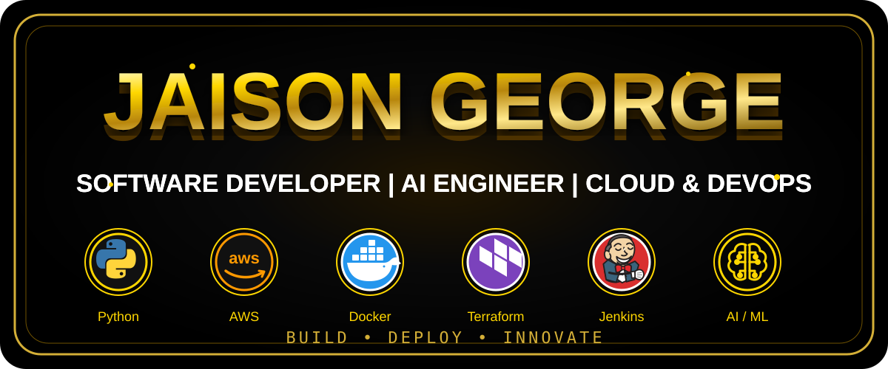

<!-- 
Profile README for JaisonGeorge04 
Repository:   
github.com/JaisonGeorge04/JaisonGeorge04  
   
Assets:
./assets/banner.svg   
./avi-ascii.svg  
./info-card.svg
./contrib-heatmap.svg  
--> 

<!-- Premium Animated Gold Banner -->

  

 

<h1 align="center">
  Hi 👋, I'm Jaison George
</h1>

<h3 align="center">
  Software Developer | AI Engineer | Cloud & DevOps Enthusiast
</h3>

  Building scalable applications, AI-powered solutions, and cloud-native systems.

## 👨‍💻 About Me

I'm a passionate **Software Developer** focused on **Artificial Intelligence, Full-Stack Development, and Cloud Computing**. I enjoy building practical applications that solve real-world problems while continuously learning modern technologies.

<table>
<tr>

<td width="50%" valign="top">

### 🚀 What I'm Working On

- 🤖 AI-powered Applications
- 💻 Full-Stack Web Development
- ☁️ Cloud & DevOps
- 🔐 Secure Software Development
- 🌍 Real-World Software Projects

</td>

<td width="50%" valign="top">

### 📚 Currently Learning

- 🏗️ System Design
- ⚡ Data Structures & Algorithms
- ☁️ AWS Cloud Architecture
- 🔄 DevOps Practices
- 🤖 Generative AI

</td>

</tr>
</table>

💡 <i>"Always learning, always building, and always improving."</i>

## 🛠️ 💼 Skills & Technologies

<table>
<tr>
<td align="center" width="33%">

### 💻 Languages

</td>

<td align="center" width="33%">

### ⚙️ Frameworks

</td>

<td align="center" width="33%">

### 🗄️ Databases

</td>

</tr>

<tr>

<td align="center">

### ☁️ Cloud & DevOps

</td>

<td align="center">

### 🛠️ Tools

</td>

<td align="center">

### 🤖 AI & ML

</td>

</tr>

</table>

 

## 🚀 Featured Projects

<table>
<tr>

<td width="50%" valign="top">

### 🩺 Breast Cancer Prediction System

A machine learning web application that predicts whether a breast tumor is **Benign** or **Malignant** using trained classification models through an interactive Streamlit interface.

**Tech Stack**

`Python` `Scikit-learn` `Pandas` `NumPy` `Streamlit`

</td>

<td width="50%" valign="top">

### 🏨 Hostel Management System 

A role-based hostel management system for managing student records, room allocation, fee management, and administrative operations.

**Tech Stack**

`Python` `Django` `SQLite` `Bootstrap`

</td>

</tr>

<tr>

<td width="50%" valign="top">

### 🌐 Personal Portfolio

A responsive personal portfolio showcasing my projects, technical skills, certifications, and contact information with a modern user interface.

**Tech Stack**

`HTML` `CSS` `JavaScript`

</td>

<td width="50%" valign="top" align="center">

### 🚧 More Projects

Currently working on:

- 🤖 AI Resume Analyzer
- ☁️ Cloud & DevOps Projects
- 🔐 Cybersecurity Projects

</td>

</tr>
</table>

## 📜 Certifications & Industry Project

<table>
<tr>

<td width="50%" valign="top">

### 🎓 Certifications

🛡️ **Introduction to Cybersecurity**  
Cisco Networking Academy

---

🤖 **One Million Prompters – Prompt Engineering**

---

📈 **Fundamentals of Digital Marketing**  
UniAthena

### 💼 Industry Project

🏢 **TCS iON Applied Industry Project**

**Project**

🔐 Securing a Smart Home Ecosystem

**Duration**

⏱️ 90-Hour Industry Project

---

### 📚 Learning Focus

- Artificial Intelligence
- Cloud Computing
- DevOps
- Cybersecurity
- Software Development

</td>

</tr>
</table>

 
<h2 align="center">📊 GitHub Activity & Contributions</h2>

 
  

<!-- Contribution Animation -->

 
 

